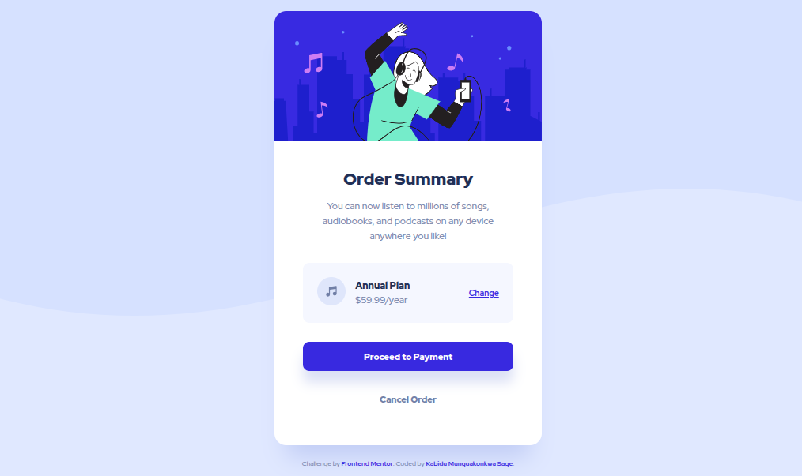

# Frontend Mentor - Order summary card solution

This is a solution to the [Order summary card challenge on Frontend Mentor](https://www.frontendmentor.io/challenges/order-summary-component-QlPmajDUj). Frontend Mentor challenges help you improve your coding skills by building realistic projects. 



## Table of contents

- [Overview](#overview)
  - [The challenge](#the-challenge)
  - [Links](#links)
- [My process](#my-process)
  - [Built with](#built-with)
  - [What I learned](#what-i-learned)
  - [Continued development](#continued-development)
  - [Useful resources](#useful-resources)
- [Author](#author)

## Overview

### The challenge

Users should be able to:

- See hover states for interactive elements in the order summary card, such as the "Change" link and the action buttons.
- View an optimal layout depending on their device's screen size (Responsive design suited for 375px mobile and 1440px desktop screens).

### Links

- Solution URL: [Add solution URL here](https://www.frontendmentor.io/solutions/frontend-mentor---order-summary-card-l4djtCktIx)
- Live Site URL: [Add live site URL here](https://freedev-group.github.io/Order-summary-component-Kabidu/)

## My process

### Built with

- Semantic HTML5 markup
- CSS custom properties (variables)
- Flexbox
- Mobile-first workflow

### What I learned

During this project, I improved my ability to use CSS custom properties to maintain a consistent color palette. I've also practiced using Flexbox for perfectly centering the main card element on the viewport.

Here's an example of setting up CSS variables for the color palette based on the style guide:

```css
:root {
  --pale-blue: hsl(225, 100%, 94%);
  --bright-blue: hsl(245, 75%, 52%);
  --very-pale-blue: hsl(225, 100%, 98%);
  --desaturated-blue: hsl(224, 23%, 55%);
  --dark-blue: hsl(223, 47%, 23%);
  --hover-blue: hsl(245, 83%, 68%);
}
```

I also improved my CSS Flexbox skills for centering the card element:

```css
body {
  display: flex;
  flex-direction: column;
  align-items: center;
  justify-content: center;
  min-height: 100vh;
}
```

### Continued development

Going forward, I outline these areas of focus:
- Continue practicing responsive design and mobile-first to ensure components look great on screens of any dimensions.
- Improve my understanding of CSS media queries for changing background graphics flawlessly across viewports.

### Useful resources

- [MDN Web Docs - CSS Flexbox](https://developer.mozilla.org/en-US/docs/Web/CSS/CSS_Flexible_Box_Layout/Basic_Concepts_of_Flexbox) - An excellent resource to quickly remember flex properties.
- [Frontend Mentor](https://www.frontendmentor.io/resources) resources and community - Extremely helpful for feedback and seeing how others solve similar challenges.

## Author

- Coded by **Kabidu Munguakonkwa Sage**
- Frontend Mentor - [@Abidusage](https://www.frontendmentor.io/profile/Abidusage)
